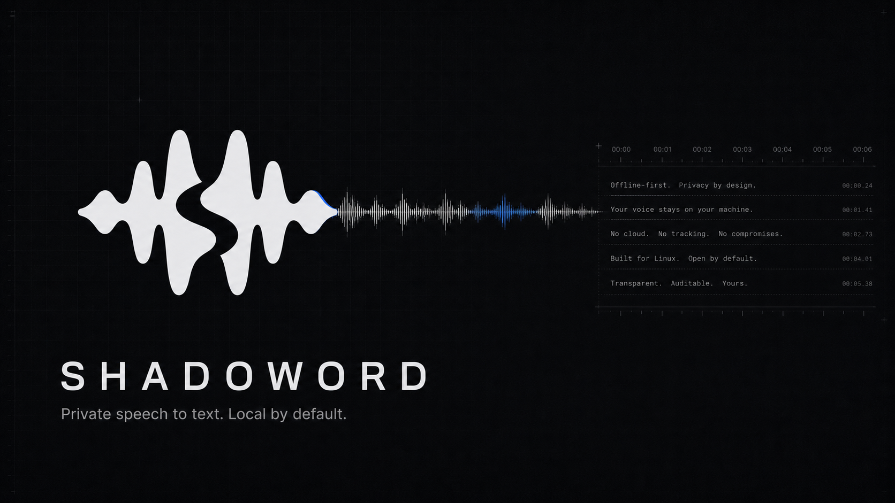

# Shadoword



Offline speech-to-text workspace with:

- a native Tauri 2 + SvelteKit desktop client with local and remote inference
- an optional authenticated HTTP/WebSocket daemon

The frontend uses Bun exclusively; audio, inference, API, and desktop behavior remain Rust and Whisper-focused.

## Workspace

- `crates/shadoword-core` - shared audio/config/transcription service logic
- `crates/shadoword-model-whisper` - Whisper model implementation
- `crates/shadoword-shared` - shared trait/types contracts
- `crates/shadoword-desktop` - Tauri 2, SvelteKit, and shadcn-svelte desktop client
- `crates/shadoword-api` - HTTP daemon

## Backend selection

Plain Cargo builds use the CPU Whisper backend. GPU acceleration is optional:

- `whisper-vulkan`
- `whisper-cuda`

Desktop examples:

```bash
cd crates/shadoword-desktop
bun run tauri dev
bun run tauri dev -- --features whisper-vulkan
bun run tauri dev -- --features whisper-cuda
```

### Desktop client profile

The desktop-only client profile keeps microphone capture, VAD streaming, direct
OpenRouter transcription, history, hotkeys, tray behavior, and transcript delivery,
but removes local Whisper inference and local model management from the build:

```bash
cd crates/shadoword-desktop
bun run tauri dev -- --no-default-features --features remote-client
```

This profile can use either a configured remote API or direct OpenRouter
transcription and presents daemon runtime and model controls only in remote mode.
The full desktop package embeds the portable CPU Whisper runtime in the same
executable while retaining both remote options.

## Releases

Version tags publish changelog-backed GitHub releases with precompiled Linux
x86_64 archives:

- `shadoword-api-cpu-x86_64-linux.tar.gz`
- `shadoword-api-cuda-x86_64-linux.tar.gz`
- `shadoword-api-vulkan-x86_64-linux.tar.gz`
- `shadoword-desktop-client-x86_64-linux.tar.gz` — desktop UI and native capture for remote/OpenRouter transcription
- `shadoword-desktop-cpu-x86_64-linux.tar.gz` — desktop UI with the embedded CPU Whisper runtime

Together these cover API-only, desktop-only, and combined desktop/runtime
installations. Each release also includes `SHA256SUMS`. The archives contain the stripped ELF
executables used by the Nix packages, allowing NixOS deployments to download
and patch the release binaries without compiling Rust, CUDA, or the desktop
frontend locally.

Release notes are sourced from [`CHANGELOG.md`](CHANGELOG.md). To publish a
release, update the workspace and desktop versions plus the changelog, commit
the changes, then push the matching `v<version>` tag.

## Development

### Nix

```bash
nix develop
cd crates/shadoword-desktop
bun run tauri dev -- --features whisper-vulkan
```

CUDA shell:

```bash
nix develop .#cuda
cd crates/shadoword-desktop
bun run tauri dev -- --features whisper-cuda
```

### Desktop client

The Tauri desktop supports local Whisper, remote API inference, direct OpenRouter
speech-to-text, batch and VAD-segmented streaming transcription, global shortcuts,
tray behavior, and transcript delivery. OpenRouter credentials remain in the
native desktop configuration and audio is sent only when OpenRouter is selected.

```bash
cd crates/shadoword-desktop
bun install
bun run dev
bun run tauri dev
```

Frontend checks use Bun only:

```bash
bun run check
bun run lint
bun run build
```

### Public marketing website

A dedicated Astro + Nginx website lives in `website/`:

- Landing page with React-powered motion hero section
- Nginx runtime-ready static output
- Docker production image in `website/Dockerfile`

```bash
cd website
bun install
bun run dev
bun run build
bun run check
bun run lint
```

To run in production via Docker:

```bash
docker build -t shadoword-website ./website
docker run --rm -p 8080:80 shadoword-website
```

### Plain Cargo

```bash
cargo build
cargo run -p shadoword-api --features whisper-vulkan
```

## Docker (daemon)

```bash
./docker/export-rootfs.sh
docker build -t shadoword-backend .
```

Run the CPU API image:

```bash
docker run --rm -p 47813:47813 \
  -e SHADOWORD_API_TOKEN="$(cat ./api-token)" \
  -v $PWD/docker/config:/config \
  -v $HOME/.local/share/shadoword/models:/data/shadoword/models \
  shadoword-backend
```

CUDA remains an opt-in Cargo/Nix development feature; the published daemon image uses the portable CPU backend.

The API defaults to preloading the canonical catalog `turbo` model
(`ggml-large-v3-turbo.bin`). If the selected model file is missing, startup
fails unless an explicit startup download installs it first:

```bash
cargo run -p shadoword-api -- \
  --download-model turbo
```

Non-loopback binds require bearer auth from `SHADOWORD_API_TOKEN` or
`--token-file`/`SHADOWORD_API_TOKEN_FILE`. Token files must be mode `0600`.
`GET /health` is public. All other endpoints are protected whenever auth is
configured.

For opt-in debugging, the daemon can archive every accepted batch request and
every committed WebSocket segment as a WAV file with JSON response metadata:

```bash
shadoword-api --request-recording-dir /var/lib/shadoword/requests
# or: SHADOWORD_REQUEST_RECORDING_DIR=/var/lib/shadoword/requests
```

The archive contains microphone audio and transcripts, so keep the directory
private and apply an appropriate retention policy.

Daemon endpoints:

- `GET /health`
- `GET /docs`
- `GET /v1/status`
- `GET /v1/overview`
- `GET /v1/config`
- `PUT /v1/config`
- `POST /v1/transcribe-wav`
- `GET /v1/stream`
- `GET /v1/models`
- `POST /v1/models/{id}/select`
- `POST /v1/downloads`
- `GET /v1/downloads/{id}`

`POST /v1/transcribe-wav` accepts a raw WAV request body capped at 64 MiB.
The legacy base64 transcription and remote-device endpoints are not part of the API. Runtime configuration uses the restricted daemon DTO described below.

The preferred WebSocket protocol streams PCM immediately from key-down and
performs segmentation on the daemon:

1. Send text JSON `{"type":"Start","sample_rate":16000,"channels":1,"protocol_version":3,"audio_format":"pcm_f32le"}`. Protocol v3 accepts `pcm_f32le` and `pcm_s16le` on the same endpoint.
2. Send binary mono PCM messages in the advertised little-endian format as microphone samples arrive.
3. The daemon runs VAD, commits bounded segments, and emits ordered `Accepted` and
   `Partial` messages while recording continues.
4. Send text `Finish` to force-flush remaining speech and receive `Done` after all
   ordered inference completes.

Protocols v1 and v2 remain available for existing clients that send raw Opus
packets followed by `CommitSegment`. PCM/Opus packet sizes, accumulated segment
duration, inference flow credit, sequencer buffers, and stream idle time are
bounded.

Runtime config is intentionally restricted to daemon-safe fields:
`model_path`, `whisper_accelerator`, `whisper_gpu_device`, `english_only`, and
`preload_on_startup`.
Model downloads are explicit catalog jobs only:

```bash
curl -H "Authorization: Bearer $SHADOWORD_API_TOKEN" \
  -H "Content-Type: application/json" \
  -d '{"model_id":"turbo"}' \
  http://127.0.0.1:47813/v1/downloads
```
