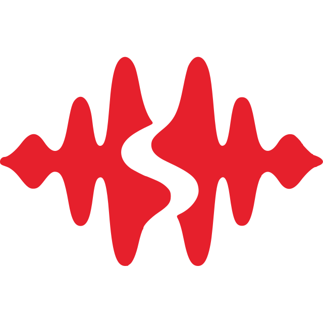

# Shadoword

<p align="center">
  
</p>

Private speech-to-text for Linux. Hold a shortcut, speak, and send the transcript to the active application.

Shadoword supports three execution modes:

- **Local** — offline Whisper inference on your machine
- **Shadoword API** — self-hosted transcription from another machine
- **OpenRouter** — optional direct, batch-only transcription

The desktop is built with Tauri 2 and SvelteKit. Audio capture, inference, credentials, hotkeys, tray behavior, and text delivery remain in Rust.

## Install

Download the Linux desktop archive from [GitHub Releases](https://github.com/Fractal-Tess/shadoword/releases):

```text
shadoword-desktop-x86_64-linux.tar.gz
shadoword-desktop-cuda-x86_64-linux.tar.gz
shadoword-desktop-vulkan-x86_64-linux.tar.gz
```

All desktop archives install the `shadoword` command. Choose the CUDA or Vulkan archive for accelerated local inference. Each release also includes `SHA256SUMS` and matching CPU, CUDA, and Vulkan API daemon archives.

Nix source packages are also available:

```bash
nix build github:Fractal-Tess/shadoword#shadoword-desktop-source
nix build github:Fractal-Tess/shadoword#shadoword-desktop-cuda-source
nix build github:Fractal-Tess/shadoword#shadoword-desktop-vulkan-source
nix build github:Fractal-Tess/shadoword#shadoword-api-source
```

## NixOS

The flake exposes `nixosModules.default`, which runs the daemon and puts the
`shadoword-api` CLI on the system path pointed at the service's own config file:

```nix
{
  inputs.shadoword.url = "github:Fractal-Tess/shadoword";

  # in your nixosSystem modules:
  imports = [ inputs.shadoword.nixosModules.default ];

  services.shadoword-api = {
    enable = true;
    variant = "cuda";                              # "cpu" (default), "cuda", or "vulkan"
    listenAddress = "0.0.0.0";
    initTokenFile = config.sops.secrets.shadoword_admin_token.path;
  };
}
```

`variant` picks the matching prebuilt release archive, so enabling the CUDA build
does not compile it locally and does not push `allowUnfree` onto the host's
nixpkgs. `package` overrides the choice outright. Without `initTokenFile`, issue
the first token by hand:

```bash
sudo -u shadoword shadoword-api token generate admin "desktop administrator"
sudo systemctl restart shadoword-api
```

`overlays.default` is also available if you would rather reach the builds as
`pkgs.shadoword-api`, `pkgs.shadoword-api-cuda`, or `pkgs.shadoword-desktop`.

## Develop

CPU Whisper is the default backend:

```bash
cargo build
cargo run -p shadoword-api

cd crates/shadoword-desktop
bun install
bun run tauri dev
```

Vulkan:

```bash
nix develop
cd crates/shadoword-desktop
bun run tauri dev -- --features whisper-vulkan
```

CUDA:

```bash
nix develop .#cuda
cd crates/shadoword-desktop
bun run tauri dev -- --features whisper-cuda
```

## Shadoword API

Every request needs a token, on loopback as much as anywhere else. A daemon with
no tokens refuses to start, so generate the first one before the first run:

```bash
shadoword-api token generate admin "desktop administrator"
shadoword-api token generate user "transcription client"
shadoword-api token list
shadoword-api token revoke "transcription client"
```

Token secrets are printed once. Only SHA-256 hashes are stored in the API configuration.

Where running the CLI first is awkward — containers, or a NixOS unit fed by a
secret manager — set `SHADOWORD_INIT_TOKEN_FILE` to a file holding an admin token,
or `SHADOWORD_INIT_TOKEN` to the value itself. Prefer the file: an environment
variable is readable by anything that can see the process. Either one is adopted
only while the daemon has no tokens, so a restart never resurrects a token you
revoked on purpose.

The CLI edits the config file, so a running daemon has to be restarted to pick up its
changes. An admin token can instead manage tokens over HTTP, which takes effect
immediately and needs no restart:

```bash
curl -H "Authorization: Bearer $ADMIN_TOKEN" http://127.0.0.1:47813/v1/tokens
curl -H "Authorization: Bearer $ADMIN_TOKEN" -H 'content-type: application/json' \
  -d '{"name":"transcription client","role":"user"}' http://127.0.0.1:47813/v1/tokens
curl -X DELETE -H "Authorization: Bearer $ADMIN_TOKEN" \
  "http://127.0.0.1:47813/v1/tokens/transcription%20client"
```

Shadoword Desktop exposes the same three operations under Settings → Runtime when it is
connected to a daemon with an admin token.

- **Admin tokens** can manage tokens, models, downloads, configuration, and transcription.
- **User tokens** can only submit batch or streaming transcription requests.
- The last remaining admin token cannot be revoked, so a daemon cannot lock itself out.
- `GET /health` and `GET /v1/version` are public.

Start the daemon and download the default Turbo model when needed:

```bash
shadoword-api --download-model turbo
```

Main endpoints:

```text
GET    /health
GET    /v1/version
POST   /v1/transcribe-wav
GET    /v1/stream
GET    /v1/overview
GET    /v1/models
GET    /v1/tokens
POST   /v1/tokens
DELETE /v1/tokens/{name}
```

Use `shadoword-api --help` for configuration, model, and request-recording options.

## Docker

CPU, CUDA, and Vulkan daemon images are published to both `ghcr.io/fractal-tess/shadoword-backend` and `vgfractal/shadoword-backend` on Docker Hub.

| Backend | Rolling tag | Versioned tag |
| --- | --- | --- |
| CPU | `latest` or `cpu` | `<version>` or `<version>-cpu` |
| CUDA | `cuda` | `<version>-cuda` |
| Vulkan | `vulkan` | `<version>-vulkan` |

Mount persistent configuration and model directories at `/config` and `/data`; both are declared volumes, and an unmounted `/config` loses every token the daemon was given when the container is replaced. Start from [`docker/config/shadoword/api.json.example`](docker/config/shadoword/api.json.example), using `"cpu"` for the CPU image and `"gpu"` for CUDA or Vulkan.

Seed the first admin token with a Docker secret:

```yaml
services:
  shadoword-api:
    image: ghcr.io/fractal-tess/shadoword-backend:cuda
    environment:
      SHADOWORD_INIT_TOKEN_FILE: /run/secrets/shadoword_admin_token
    secrets: [shadoword_admin_token]
    volumes:
      - ./config:/config
      - ./data:/data
    ports: ["47813:47813"]
```

CUDA requires the NVIDIA Container Toolkit and `--gpus all`. Vulkan on AMD or Intel requires the render device, for example `--device /dev/dri`, plus access to the device's host group.

The container images are reproducible Flake outputs built directly from the Nix package closures without a mutable distribution base image or `apt-get`. To build and load a variant locally:

```bash
image=$(nix build .#shadoword-container-cpu --no-link --print-out-paths) # or -cuda / -vulkan
docker load < "$image"
```

Release automation reuses the exact CPU, CUDA, and Vulkan API derivations for the binary archives and their corresponding layered container images.

## Checks

```bash
cargo check --workspace --all-targets
cargo fmt --all -- --check
cargo clippy --workspace --all-targets -- -D warnings

cd crates/shadoword-desktop
bun run generate:bindings
bun run check
bun run lint
bun run build
```

## Workspace

- `crates/shadoword-core` — audio, configuration, models, and transcription orchestration
- `crates/shadoword-model-whisper` — Whisper backend
- `crates/shadoword-shared` — shared model contracts
- `crates/shadoword-desktop` — Tauri and SvelteKit desktop
- `crates/shadoword-api` — HTTP and WebSocket daemon
- `website` — public website

See [`CHANGELOG.md`](CHANGELOG.md) for release history and [`crates/shadoword-desktop/README.md`](crates/shadoword-desktop/README.md) for desktop-specific development notes.
